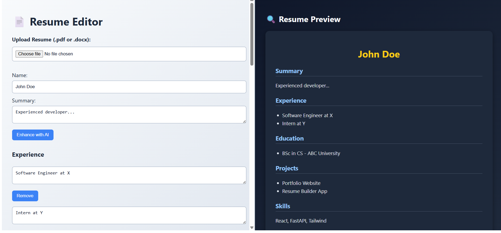

🧠 Resume Editor with AI Enhancement

A sleek, modern, and responsive resume editor built with React.js and FastAPI, offering:
- ✅ Resume Upload (.pdf or .docx)
- ✏️ Live Editing of Resume Sections
- 🚀 AI Enhancement (Mocked)
- 💾 Save to backend (mocked)
- ⬇️ Download as `.json`
- 🔍 Live Preview resembling a real resume (HackerRank/Canva-style UI)-style UI)

 🗂️ Project Structure

```

📁 Resume-Editor/
├── frontend/     
└── backend/      

````

---

 ⚙️ Setup Instructions

 🔽 Clone the Repository

```bash
git clone https://github.com/Mukunda2000/Resume-Editor.git
cd Resume-Editor
````

---

 🖥️ Frontend Setup (`React`)

 📁 Go to the `frontend` directory:

```bash
cd frontend
```

 📦 Install dependencies:

```bash
npm install
```

 ▶️ Run the frontend app:

```bash
npm start
```

* The app will be live at: [http://localhost:3000](http://localhost:3000)
* Make sure the backend is also running for AI features to work.

---

 🚀 Backend Setup (`FastAPI`)

 📁 Navigate to backend directory:

```bash
cd ../backend
```

 🐍 Create and activate a virtual environment:

```bash
# For Windows:
python -m venv venv
venv\Scripts\activate

# For Mac/Linux:
python3 -m venv venv
source venv/bin/activate
```

 📦 Install dependencies:

```bash
pip install fastapi uvicorn python-multipart
```

 ▶️ Run the backend server:

```bash
uvicorn main:app --reload
```

* Backend will start at: [http://localhost:8000](http://localhost:8000)

---

 🧠 AI Enhancement API (Mock)

* Endpoint: `POST /ai-enhance`
* Sends a section and content to the backend, gets improved content in return
* 🔒 *Does not add extra sections, only enhances text in-place*

Example:

```json
POST /ai-enhance
{
  "section": "skills",
  "content": "React | FastAPI"
}
```

Returns:

```json
{
  "enhanced_content": "React | FastAPI | Time Management"
}
```

---

 📂 File Upload Support

* Accepts `.pdf` and `.docx` files
* Parses them with a mocked response
* Allows editing parsed resume

---

 🎨 Features

| Feature               | Description                                     |
| --------------------- | ----------------------------------------------- |
| 🎨 Modern UI          | Clean layout like Canva or HackerRank Resume    |
| 🌓 Dark+Light Mix     | Left panel (light), right panel (dark resume)   |
| ⚡ Button Animations   | Hover, click, focus effects for great UX        |
| 🔍 Live Preview       | Real-time preview of resume on right            |
| 💾 Save / ⬇️ Download | Save JSON to backend and download locally       |
| 🔐 CORS Enabled       | Fully configured frontend-backend communication |

---


 🖼️ Screenshot




---

 👨‍💻 Author

Developed with 💖 by **Mukunda Mondal**
📬 Contact: [mondalmukunda2000@gmail.com](mailto:mondalmukunda2000@gmail.com)
🔗 GitHub: [github.com/Mukunda2000](https://github.com/Mukunda2000)

---

 🛠️ Future Improvements

* 🖨️ Export to PDF
* 📱 Mobile responsive layout
* 🎨 Multiple resume templates
```
